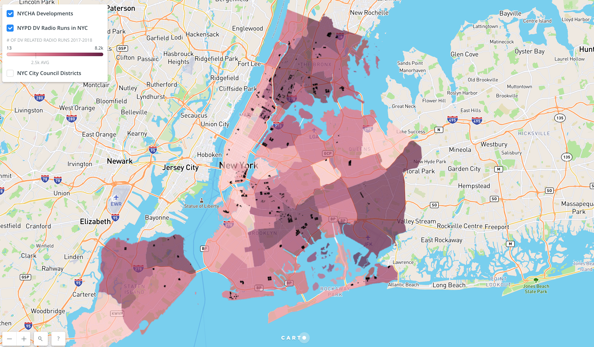

# Getting data behind intimate partner violence in NYC

<p align="center">
    <a href="#travis" alt="Travis-CI">
        
    </a>
    <a href="#docker-build" alt="Docker build">
        
    </a>
    <a>
        
    </a>
</p>

While violent crimes in New York City has dropped precipitously since the early 1990s, domestic violence remains an ongoing and underreported problem, most commonly found in the form of Intimate Partner Violence (IPV). [According to the CDC](https://www.cdc.gov/violenceprevention/index.html), one out of four women in the U.S. has experienced an incident of domestic violence by an intimate partner. In NYC, it’s estimated that nearly [352,000](https://www1.nyc.gov/assets/criminaljustice/downloads/pdfs/domestic-violence-task-force-2017-recommendations.pdf) residents are victimized by an intimate partner each year.

Incidents of domestic violence or intimate partner violence affect every neighborhood in the city, with varying degree of incidents reported at the local level, as filed under official precinct data.

This project aggregates and visualizes data on domestic violence incidents collected by the NYPD from January through December 2017.

## Project

<p align="center">
    <a href="http://bit.ly/2EnznPe" alt="">
        
    </a>
</p>

You can see the results [here!](http://bit.ly/2EnznPe)

This project downloads monthly reports from the [NYPD Domestic Violence reports webpage](https://www1.nyc.gov/site/nypd/stats/reports-analysis/domestic-violence.page), extracts precinct information from [public precinct websites](https://www1.nyc.gov/site/nypd/bureaus/patrol/precincts/1st-precinct.page), and merges the two sources to the [boundaries of NYC's police precincts](https://data.cityofnewyork.us/api/geospatial/78dh-3ptz?method=export&format=GeoJSON).

## Data Sources

* [NYPD Domestic Violence Reports](https://www1.nyc.gov/site/nypd/stats/reports-analysis/domestic-violence.page)

* [NYPD Precinct Map](https://data.cityofnewyork.us/api/geospatial/78dh-3ptz?method=export&format=GeoJSON)

* [NYPD Precincts](https://www1.nyc.gov/site/nypd/bureaus/patrol/precincts-landing.page)

* [Example of NYPD Precinct Information](https://www1.nyc.gov/site/nypd/bureaus/patrol/precincts/1st-precinct.page)

* [Map of NYCHA Developments](https://data.cityofnewyork.us/Housing-Development/Map-of-NYCHA-Developments/i9rv-hdr5)

## Getting started

To get started with the project, you need to have [Python 3](https://www.python.org/downloads/source/) and [virtualenv](http://docs.python-guide.org/en/latest/dev/virtualenvs/) set up on your local machine.

```bash
# Clone the repo and setup the environment and move into the dv-in-nyc directory
git clone https://github.com/kvn219/dv-in-nyc.git && cd dv-in-nyc
# Create a virtual environment and activate the virtual environment
virtualenv -p python3 venv && source venv/bin/activate
# Install the required packages
pip install requirements.txt
# Run the program!
make run
```

## Docker

If you're comfortable with docker and make, you can run the following commands:

```bash
# Build the dockerfile locally
make docker_build
# Get inside the running docker container
make docker_run
```

## Example use case

[Create a choropleth Bokeh!](http://nbviewer.jupyter.org/github/kvn219/ipv/blob/master/notebooks/UseCases.ipynb)
